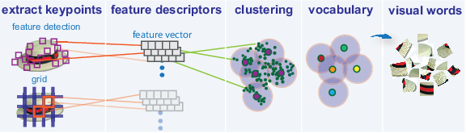

# Computer-Vision-Project

An example of a typical bag of words classification pipeline. Figure by <a href="https://fr.mathworks.com/help/vision/ug/image-classification-with-bag-of-visual-words.html"</a> 

<h1>Computer Vision Project: Object Recognition using BoW as first approach and CNN as second approach. 
</h1> 

 
<h2>Brief</h2> 

 

<ul> 
  
  <li><i>Partial</i> You have to download <a href="http://www.vlfeat.org/download.html">VLFeat 0.9.17 binary package</a></li> 
  <li>VL Feat Matlab reference: <a href="http://www.vlfeat.org/matlab/matlab.html">http://www.vlfeat.org/matlab/matlab.html</a>
  <li>MatConvNet Matlab reference: <a href="http://http://www.vlfeat.org/matconvnet/">http://http://www.vlfeat.org/matconvnet/</a>
  <li>To be able to use CNN: <a href="http://www.robots.ox.ac.uk/~vgg/software/deep_eval/">http://www.robots.ox.ac.uk/~vgg/software/deep_eval/</a>  
  

</ul>

 
 
<h2>Overview</h2> 

 
The scope of this project is to implement two approaches for object recognition. The first one is based on Bag of Words models, where we extract handcrafted features (dense sift features). The visual vocabulary is created by clustering a large amount of local descriptors and we make use of the centers as visual vocabulary. Then, we encode each image by creating i)'hard' histograms and ii)spatial histograms. In the second approach we use a fine-tuned pre-trained CNN model by extracting a full connected layer as our feature representation and after we feed these deep features to a Linear SVM classifier.

First we create a baseline for BoW. We use the training and validation set to extract dense SIFT features and from each image we keep 300 descriptors, so in total we get around 1.5 million descriptors from train+val images. K-means is used to cluster these descriptors, using the Elkan algorithm (triangle inequality) and k-means PLUSPLUS to intialize the centers. Four different numbers of clusters are used {200, 500, 800, 1000} and we save the centroids as our vocabulary, which we use after to encode each image into 'hard' histograms.When we have our feature sets ready, we map them into homogeneous kernel maps (intersection kernel, chi2 kernel) and then we feed them to a linear SVM and we see which vocabulary size (200, 500, 800, 1000) gives the best performance (using 1000 clusters yields the best performance). After we set our baseline, we use spatial histogram encoding {1x1} and {1x3} regions which results in a 4000 dimensionality histogram for each image. 

This task is a multi-label classification, because each image may contain more than one object. To classify our images, we create 20 binary classifiers (one for each class) and for each classifier we get the scores when we put the the testing data. In the end we can use all the weights from the 20 classifiers to classify our objects. For our experiments we use the PASCAL VOC 2007 dataset.

Using CNN as our second approach, we use a fine-tuned pre-trained CNN model and we exploit the full connected layer to use it as our feature representation, which we feed into a Linear SVM. <a href="http://www.robots.ox.ac.uk/~vgg/software/deep_eval/">http://www.robots.ox.ac.uk/~vgg/software/deep_eval/</a>  

